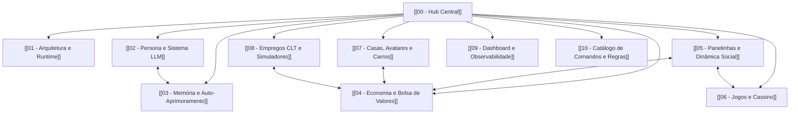

# 🧠 Cérebro do Projeto — TooManyBots (Módulo Fun)

Bem-vindo ao **cérebro operacional e arquitetural** do bot de entretenimento `fun` do **TooManyBots**. Este cofre do Obsidian documenta minuciosamente toda a engenharia, sistemas sociais, regras de economia, pipelines de IA e subsistemas interativos desenvolvidos no ecossistema.

> [!abstract] Visão Geral
> O **Fun Bot** é um processo standalone em Node.js (`npm run fun`), desacoplado do interpretador de fluxos de atendimento (`.tmb`). Ele opera em grupos de WhatsApp autorizados via Baileys, fornecendo uma experiência gamificada contínua: economia em 4 camadas, bolsa de valores com corretora web, cassino completo, panelinhas com ponte social, residências virtuais 2D/3D no estilo Habbo, personalização de avatares/carros, simulações de emprego e uma **Persona viva** movida a IA local.

---

## 🗺️ Mapa de Conteúdo (MOC)

Explore os subsistemas do projeto através das notas conectadas:

### 1. Núcleo & Infraestrutura
- [[01 - Arquitetura e Runtime]]: Inicialização, filas duplas (`commandQueue` e `outputQueue`), resolução de identidade (`LID` vs `PN`), isolamento por `scope_key`, SQLite schema v37 e o Relógio do Mundo (`worldAutonomous`).
- [[09 - Dashboard e Observabilidade]]: Painel TUI terminal em 5 abas, API HTTP interna (porta 8790) e o Dashboard administrativo Next.js 15 (porta 3001).

### 2. Inteligência Artificial & Vida Social
- [[02 - Persona e Sistema LLM]]: A filosofia do "Bot Membro Vivo", desassistencialização, cadência variável, ferramentas autônomas da Persona, síntese de voz Gemini TTS e governança de tarefas Zen.
- [[03 - Memória e Auto-Aprimoramento]]: Buffer e extração de lore em lotes com proteção de threads (`GAP`), sistema de auto-cura (`selfHealingService`), log de evidências e o Jornal diário das 23:59.
- [[05 - Panelinhas e Dinâmica Social]]: Matriz contínua de Vínculos 4D, 8 arquétipos relacionais, contratos de caça do submundo (`/bounty`), Tribunal do Povo (`/tribunal`), casamento ativo, divórcio litigioso e o sistema de facções com índice de ponte social.

### 3. Economia & Negócios
- [[04 - Economia e Bolsa de Valores]]: Arquitetura em 4 camadas (Motor determinístico C1, Jornalista C2, Arquétipos C3, Regulador C4), as 6 corporações da bolsa, histórico de ticks e a Corretora Web isolada.
- [[07 - Casas, Avatares e Carros]]: Casas virtuais com física de grid 2D/3D (Three.js), sistema de limpeza e invasão/roubo, customizador de avatares V2 e estúdio 3D de customização de carros.

### 4. Jogabilidade & Atividades
- [[06 - Jogos e Cassino]]: Roleta europeia completa com regra *La Partage*, Crash, 21 (Blackjack), Bingo, Desafios Diários de lógica/Pokémon e jogos multiplayer em tempo real (Quiz Royale, Grid CTF, King of the Hill) via SSE.
- [[08 - Empregos CLT e Simuladores]]: Sistema de contratação CLT, simulador tático de combate a incêndio dos Bombeiros (`FirefighterEngine`), hacking de firewall de estagiário e regras de expediente.
- [[10 - Catálogo de Comandos e Regras]]: Referência de todos os 50+ comandos com permissões, categorias, restrições de escopo e comandos exclusivos de grupo vs DM.

---

> [!tip] Convenções de Uso no Obsidian
> - Links entre entidades utilizam sintaxe canônica `[[Nome da Nota]]`.
> - Diagramas de fluxo e arquitetura estão compilados em Mermaid.js nativo.
> - Termos técnicos e parâmetros de configuração estão destacados em bloco de código.
