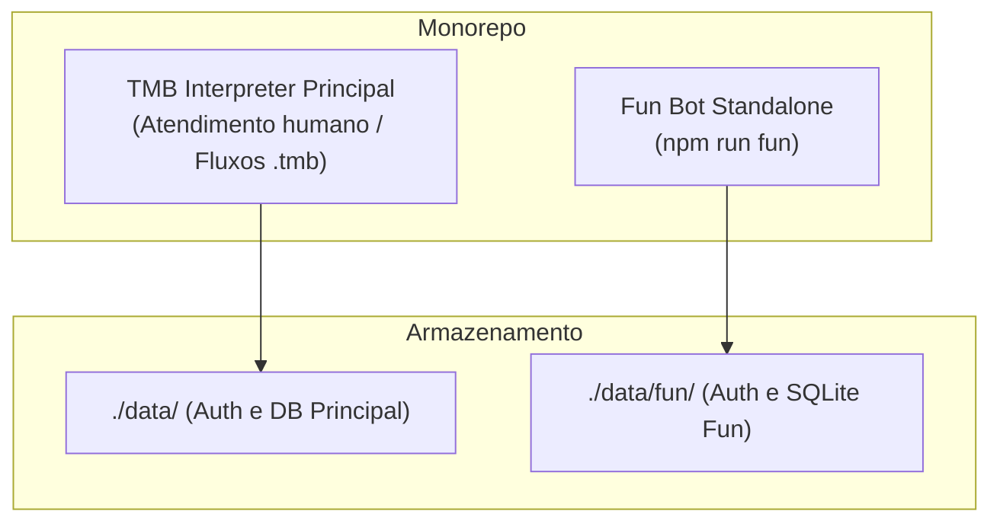
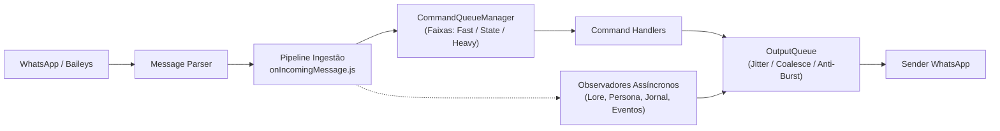
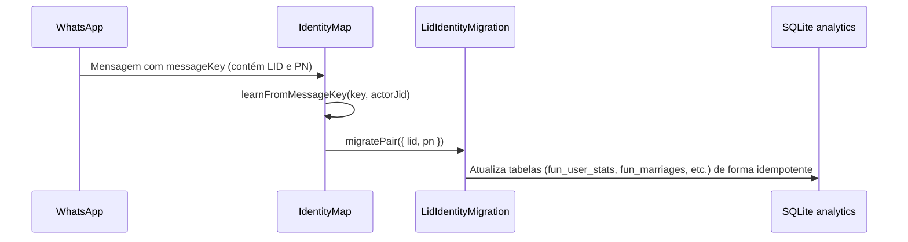

# ⚙️ Arquitetura e Runtime do Bot Fun

O módulo `fun` é arquitetado como um **processo Node.js independente** com inicialização em `fun/start.js` e execução em `fun/runtime.js`. Ele reutiliza componentes de baixo nível do TooManyBots (como a conexão Baileys, persistência de auth em SQLite e parsers de mensagem), mas opera com seu próprio banco de dados, ciclo de vida e regras de negócio.

---

## 1. Topologia de Processos e Isolamento

> [!important] Isolamento de Diretório de Dados (`TMB_DATA_DIR`)
> Em `fun/start.js`, a variável de ambiente `process.env.TMB_DATA_DIR` é fixada para `./data/fun` **antes** de qualquer importação de banco de dados (`initDb`). Isso garante que:
> - As credenciais de autenticação Baileys do Fun nunca colidam com as instâncias do bot de atendimento.
> - O arquivo SQLite do Fun viva isolado em `./data/fun/toomanybots.db`.
> - As tabelas do jogo fiquem no schema SQLite `analytics.*`.

---

## 2. Pipeline de Entrada e Filas Concorrentes

O runtime implementa um sistema sofisticado de filas duplas para gerenciar alta concorrência em grupos movimentados:

### 2.1. Fila de Comandos (`CommandQueueManager`)
Criada via `runtime/commandQueue.js` e roteada em `fun/commandQueueRouting.js`:
- **Faixa `fast` (concorrência 8)**: Comandos de leitura rápida e estado local (`/xp`, `/saldo`, `/perfil`, `/carteira`, `/ajuda`).
- **Faixa `state` (concorrência 4)**: Comandos que realizam transações críticas de banco de dados (`/pay`, `/aposta`, `/casamento`, `/comprar`, `/bazar`, `/roleta`). Concorrência reduzida para mitigar contenção de lock no SQLite WAL.
- **Faixa `heavy` (concorrência 8)**: Comandos com chamadas a serviços externos ou IA (`/gerar`, `/tarot`, `/fofoca`, `/roast`). Timeout zero no runner para evitar abortos precoces em LLMs lentas.

### 2.2. Fila de Saída (`OutputQueue`)
Criada via `runtime/outputQueue.js`:
- **Controle de Vazão Global**: Máximo de 8 envios simultâneos (`outputConcurrency`).
- **Intervalo por JID (`jidGapMs: 250ms`)**: Garante um espaçamento mínimo entre mensagens no mesmo grupo para evitar bans da Meta por rajadas instantâneas.
- **Coalescimento Inteligente (`maxCoalesceDelayMs: 1000ms`)**: Agrupa mensagens consecutivas de menor prioridade (como `flavor` e reações autônomas da Persona) evitando poluição visual.

---

## 3. Resolução de Identidade: LID vs Phone Number

O WhatsApp opera com duas identidades para o mesmo participante:
1. **PN (Phone Number)**: `<ddd><numero>@s.whatsapp.net` (legado, visível).
2. **LID (Linked Device ID)**: `<id_opaco>@lid` (moderno, privado).

> [!info] Canonicidade e Migração Idempotente
> - Dados novos são registrados prioritariamente sob o JID resolvido canônico.
> - O `createLidIdentityMigrationService` realiza a unificação transparente dos dados se um usuário começou a interagir via número de telefone e o WhatsApp passou a enviar seu LID.
> - Em mensagens privadas (DM), o bot usa `identityMap.resolve(userJid)` para mapear a conversa ao histórico do usuário nos grupos.

---

## 4. O Relógio do Mundo (`worldAutonomous`)

O runtime executa um timer central (`startWorldClock`) com intervalo padrão de **45 segundos** (`worldTickMs`). Ele dá autonomia ao bot para que o mundo virtual aconteça sem depender de interação humana prévia.

### Atividades do Tick do Mundo:
1. **Mercado de Ações & Rua**: Ticks do motor econômico, geração de notícias fictícias e flutuação de preços da bolsa.
2. **Happy Hour & Eventos de Escopo**: Início e fim de eventos de bônus de XP/Coins (`eventService`).
3. **Lembretes de Eventos Reais**: `eventReminderService` dispara lembretes de encontros/churrascos marcados no grupo.
4. **Follow-ups da Persona**: Verifica se a Persona deixou turnos de conversa pendentes para retomar.
5. **Auto-Aprimoramento (Self-Healing)**: Disparo periódico de varreduras de integridade dos dados (`selfHealingService`).

> [!warning] Quiet Hours (Madrugada Silenciosa)
> Entre **01:00 e 06:00** (`America/Sao_Paulo`), o módulo `isWorldQuietHours` bloqueia todos os anúncios autônomos no grupo para evitar notificações inconvenientes na madrugada.

---

## 5. Modelo de Dados e SQLite Schema v37

O esquema do banco de dados reside no namespace SQLite `analytics.*` e é auto-inicializado em `fun/schema.js` via `ensureFunSchema(db)`. O banco roda em modo **WAL (Write-Ahead Logging)** com busy timeout de 5000ms.

| Grupo de Tabelas | Tabelas Principais | Responsabilidade |
|---|---|---|
| **Estatísticas & Economia** | `fun_user_stats`, `fun_coin_ledger`, `fun_transfer_idempotency` | XP, nível, coins, log imutável de transações e idempotência. |
| **Social & Facções** | `fun_factions`, `fun_faction_members`, `fun_social_edges`, `fun_mixed_missions` | Panelinhas, cofres, pontuação de pontes e squads. |
| **Bolsa & Mercado** | `fun_stock_quotes`, `fun_stock_holdings`, `fun_stock_price_history`, `fun_market_prices` | Cotações das 6 empresas, carteiras dos jogadores e histórico. |
| **Cassino** | `fun_casino_stats`, `fun_casino_sessions`, `fun_roulette_history`, `fun_jackpot` | Sessões de Blackjack/Crash, histórico de giros e jackpot acumulado. |
| **Persona & Memória** | `fun_group_memories`, `fun_evidence_log`, `fun_persona_identities`, `fun_conversation_memories` | Fatos extraídos, hash de evidências, memórias semânticas e perfil de voz. |
| **Mundo Virtual** | `fun_houses`, `fun_house_items`, `fun_avatar_state_v2`, `fun_car_state`, `fun_sound_queue` | Decoração das casas, mobis, peças de avatar, tunagem de carros e fila de som. |
| **Eventos & Desafios** | `fun_group_events`, `fun_daily_challenges`, `fun_journal_messages` | Eventos da vida real, quiz diário e buffer bruto para o Jornal das 23:59. |

---

## 6. Navegação Relacionada
- [[02 - Persona e Sistema LLM]]: Como o pipeline encaminha dados para a IA.
- [[04 - Economia e Bolsa de Valores]]: Detalhes dos cálculos disparados pelo relógio do mundo.
- [[09 - Dashboard e Observabilidade]]: Como o TUI e a API HTTP monitoram as filas e o relógio.
