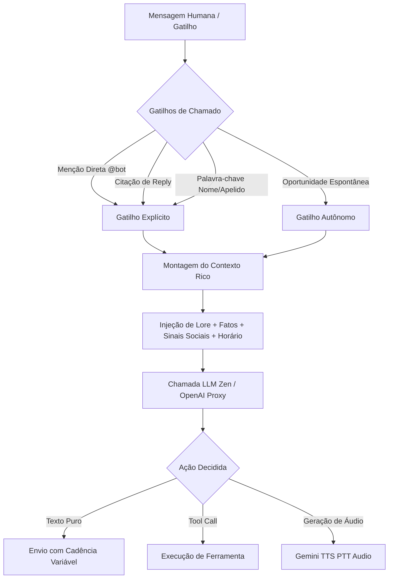
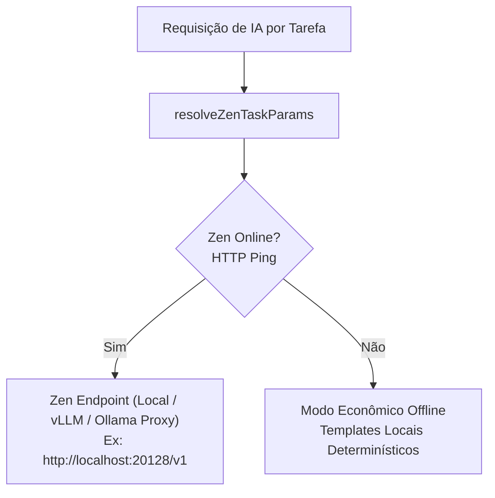

# 🤖 Persona e Sistema LLM — Bot Membro Vivo

O módulo `fun` implementa uma abordagem inovadora para agentes conversacionais em grupos de WhatsApp: o conceito do **"Bot Membro Vivo"**. Em vez de agir como um assistente corporativo subserviente ("Como posso ajudar hoje?"), o bot age como um **integrante legítimo do grupo**, com humor brasileiro, gírias locais, opiniões sustentadas, capacidade de usar figurinhas, enviar áudios reais cantados/falados e participar de brincadeiras.

---

## 1. Princípios da Desassistencialização

Em `fun/services/personaPromptBuilder.js`, o sistema aplica diretrizes rigorosas para que o modelo nunca soe como uma inteligência artificial de suporte:

### Regras de Ouro de Linguagem:
1. **Primeira pessoa autêntica**: O bot fala por si, sem rodeios ou saudações burocráticas.
2. **Humor contextual**: Se o grupo é ácido ou debochado, a Persona calibra para acompanhar o tom sem extrapolar o limite aceito pelos próprios amigos.
3. **Comprimento e cadência variáveis**: Alterna entre piadas de uma linha só (*one-liners* de 2 a 5 palavras) até respostas elaboradas quando o assunto pede história.
4. **Consciência temporal (`buildTemporalBlock`)**: Calibra a energia pelo dia e hora (ex.: respostas mais lentas e preguiçosas de madrugada; clima descontraído nos finais de semana), sem citar o relógio desnecessariamente.

---

## 2. Ferramentas Autônomas da Persona (`personaToolProtocol`)

A Persona tem acesso a um catálogo estrito de ferramentas definidas em `fun/services/personaToolProtocol.js`, executadas pelo `personaToolExecutor.js`. O modelo decide ferramentas usando chamadas JSON ou marcações estruturadas.

| Ferramenta | Tipo | O que faz | Comportamento |
|---|---|---|---|
| `help` | Leitura | Consulta documentação interna | Resposta exibida completa |
| `group_status` | Leitura | Consulta saldo, facções e ranking do grupo | Resposta exibida completa |
| `lore` | Leitura | Busca fatos e memórias persistidas do grupo | Injetado como contexto para resposta |
| `start_russian` | Efeito Colateral | Abre roleta russa e faz o primeiro disparo | Exibe resultado do tiro |
| `pull_russian` | Efeito Colateral | Puxa o gatilho da roleta já aberta | Exibe resultado do tiro |
| `daily_challenge_hint` | Efeito Colateral | Libera uma dica do enigma diário ativo | Exibe a dica no grupo |
| `tarot` | Criativo | Faz tiragem real de tarô com o consulente | Exibe a leitura completa |
| `ship` | Criativo | Mede química e romance entre 2 membros | Exibe o cálculo e zoeira |
| `reaction` | Mídia / Ação | Envia GIF animado (anime/meme) ou emoji | Envia mídia MP4 ou reação WhatsApp |
| `send_sticker` | Mídia / Ação | Envia figurinha estática/animada exclusiva | Dispara figurinha do catálogo interno |
| `send_voice` | Áudio / TTS | Gera nota de voz (PTT) com voz da Persona | Envia áudio nativo gravado via Gemini |

> [!important] Prevenção de Falsas Afirmações (Action Claim Tokens)
> O sistema possui um validador anti-alucinação (`findPersonaActionClaims`). Se o texto da LLM alegar *"mandei um áudio"* ou *"te mandei uma figurinha"*, mas o modelo **não invocou** a ferramenta correspondente, a resposta é rejeitada e reprocessada para evitar que o bot minta sobre ações físicas.

---

## 3. Síntese de Voz Nativa (`GeminiTtsService`)

Para o envio de áudios reais (`send_voice`), o módulo integra o **Google Gemini TTS**:
- Gera áudios no formato nativo de mensagem de voz do WhatsApp (`audio/ogg; codecs=opus` / PTT).
- Suporta entonações expressivas: conversas descontraídas, comemorações e até paródias cantadas.
- Configurado via `geminiApiKey` no `config.user.json`.

---

## 4. Arquitetura de Provedores LLM & Zen Proxy

O Fun Bot foi desenhado para rodar prioritariamente com **IA local de alta velocidade**:

### 4.1. Governança por Tarefa (`zenTaskParams.js`)
Cada atividade do jogo consome um perfil de amostragem específico:

| Tarefa | Uso Principal | Temperatura | Max Tokens | Timeout |
|---|---|---|---|---|
| `persona` | Respostas vivas da Persona | `0.85` | 360 | 35s |
| `extract` | Extração de memórias e lore | `0.20` | 512 | 30s |
| `selfheal` | Auditoria de integridade de dados | `0.10` | 800 | 45s |
| `flavor` | Zoeira de mercado e assaltos | `0.95` | 180 | 20s |
| `group_times` | Edição diária do Jornal das 23:59 | `0.70` | 1200 | 60s |
| `dailyGuess` | Dicas e enigmas diários | `0.60` | 400 | 25s |

### 4.2. Adaptadores de Extração (`extractionAdapters/`)
Garantem a estabilidade das extrações estruturadas da LLM:
- **`ParseGuard`**: Recupera JSONs com sintaxe truncada, aspas quebradas ou markdown residual.
- **`BufferLock`**: Impede que lotes de mensagens simultâneos gerem concorrência de escrita na lore.
- **`BatchDedup`**: Deduplica menções e fatos redundantes antes de gravar no banco de dados.
- **`MetricsRecorder`**: Alimenta o painel TUI e o dashboard com taxas de acerto e uso de templates.

---

## 5. Navegação Relacionada
- [[03 - Memória e Auto-Aprimoramento]]: Como as memórias extraídas são categorizadas e auditadas.
- [[01 - Arquitetura e Runtime]]: Filas e controle de latência no envio das respostas.
- [[09 - Dashboard e Observabilidade]]: Gráficos de consumo e métricas de tokens por tarefa.
