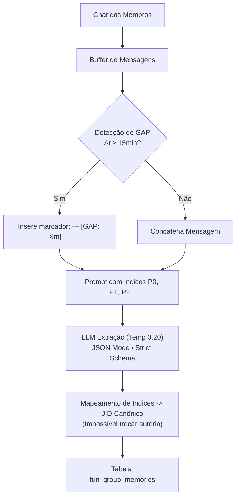
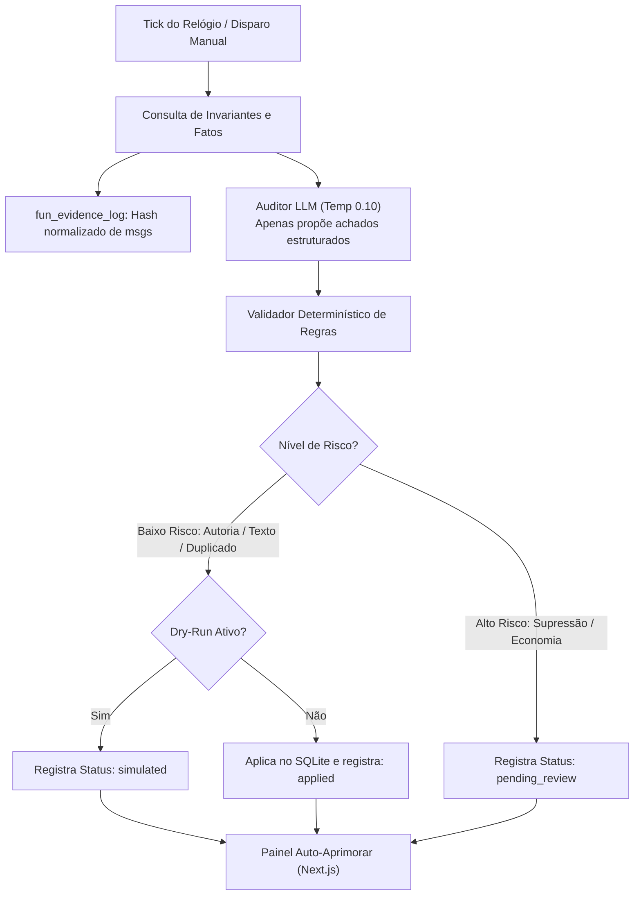
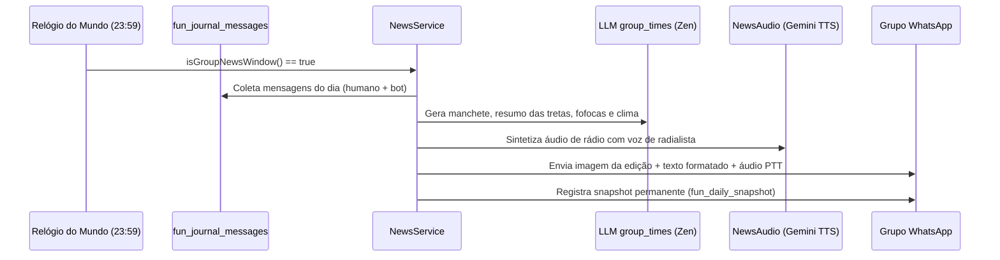

# 🧠 Memória de Grupo e Sistema de Auto-Aprimoramento

Para que o bot atue verdadeiramente como um membro da comunidade, ele precisa se lembrar dos acontecimentos marcantes, das piadas internas e das relações entre os participantes. O módulo `fun` possui uma arquitetura de memória em várias camadas, com **isolamento absoluto por grupo (`scope_key`)**, proteção contra alucinações de autoria e um mecanismo de **auto-cura determinística com auditoria humana**.

---

## 1. Extração de Lore em Lote (`groupMemoryService`)

A extração de memória não roda a cada mensagem enviada, o que seria proibitivamente lento e caro. Em vez disso:
1. Mensagens normais de chat são acumuladas em um buffer em memória por grupo.
2. Quando o buffer atinge um tamanho limite (ex.: 20 a 50 mensagens) ou tempo limite, é disparada uma tarefa assíncrona de extração via LLM (`task: extract`).

### 1.1. Proteção de Índices (`[P0]`, `[P1]`)
Para eliminar alucinações comuns onde o modelo atribui o mico a quem estava apenas fofocando sobre ele, os participantes do lote são rotulados como `P0`, `P1`, etc. O modelo é instruído a responder **apenas com os índices**. O código Node.js resolve os índices para os JIDs canônicos correspondentes antes da inserção no banco.

### 1.2. Marcadores de GAP Temporal
Se o intervalo entre duas mensagens for maior que 15 minutos, um divisor visual `--- [GAP: Xm] ---` é injetado. A LLM é instruída a **nunca associar fatos entre threads separados por GAP**, eliminando falsas conexões entre assuntos distintos.

### 1.3. Categorias de Lore (`VALID_KINDS`):
- `running_gag`: Piadas recorrentes e memes internos.
- `rivalry`: Disputas e implicâncias amigáveis entre dois membros.
- `catchphrase`: Bordões característicos de alguém.
- `epic_fail`: Micos, histórias engraçadas e erros clássicos.
- `ship_lore`: Histórico romântico ou zoações de casal.
- `nickname`: Apelidos atribuídos aos membros.
- `event`: Fatos marcantes ocorridos no grupo.

---

## 2. Auto-Aprimoramento de Dados (Self-Healing Engine)

O sistema de **Self-Healing** (`fun/services/selfHealingService.js`) realiza varreduras automáticas em segundo plano para auditar a veracidade e consistência do banco de dados, protegendo o bot de degradação da memória a longo prazo.

### 2.1. O Log de Evidências (`fun_evidence_log`)
- Mensagens elegíveis do chat são normalizadas (sem acentos/espaços extras), recebem hash SHA-256 e são armazenadas com retenção de 60 dias (`selfHealEvidenceRetentionDays`).
- Conteúdos de mídia, comandos e dados sensíveis nunca são armazenados.
- Quando o auditor de IA questiona a autoria de um fato, ele deve fornecer o `evidence_ref` que aponte para o ID exato da mensagem no log de evidências.

### 2.2. Ações Permitidas e Níveis de Risco:
| Ação | Alvo | Nível de Risco | Efeito |
|---|---|---|---|
| `fix_author` | `memory_lore` | Baixo | Corrige JID de autoria baseado em evidência direta |
| `fix_text` | `memory_lore` | Baixo | Ajusta texto do fato para manter concordância |
| `flag_unverifiable` | `memory_lore` | Baixo | Marca o fato como `unverified` sem deletar |
| `promote_confidence` | `conversation_memory` | Baixo | Eleva confiança de memórias corroboradas |
| `merge_duplicates` | `conversation_memory` | Baixo | Unifica memórias idênticas preservando hits |
| `report` | Qualquer | Baixo | Gera relatório de anomalia sem alteração |
| `suppress` / `delete` | Qualquer | **Alto** | Requer aprovação humana manual no dashboard |

> [!important] Cultura de Grupo vs Moderação
> O prompt do auditor de auto-cura possui uma diretriz inegociável: **palavrões, duplo sentido, humor ácido e gírias pesadas NUNCA são considerados defeito de dado**. O auditor só busca erros de integridade lógica (fatos contraditórios, autoria trocada, spam técnico ou alucinações).

---

## 3. Jornal Diário das 23:59 (`newsService`)

Todas as noites, na janela entre **23:59 e 00:04**, o bot gera e publica automaticamente no grupo uma edição completa do **Jornal Diário**:

### Componentes da Edição:
1. **Comentarista Residente (`newsCommentatorService`)**: Cada grupo possui um comentarista gerado com personalidade, tom de voz e bordões próprios persistidos em `fun_group_news_commentator`.
2. **Resumo das Melhores Frases**: Citações engraçadas do dia com menções aos autores.
3. **Estatísticas Econômicas e de Jogos**: Ganhadores de casino, oscilações das ações na bolsa e vencedor do Desafio Diário.
4. **Áudio de Rádio com Efeito**: Se configurado, o bot sintetiza um boletim narrado em formato de rádio com intro/vinheta.

---

## 4. Navegação Relacionada
- [[02 - Persona e Sistema LLM]]: Como o prompt da Persona consome esses fatos auditados.
- [[09 - Dashboard e Observabilidade]]: Gestão e aprovação de pendências de auto-cura pela web.
- [[04 - Economia e Bolsa de Valores]]: Eventos econômicos narrados no jornal diário.
