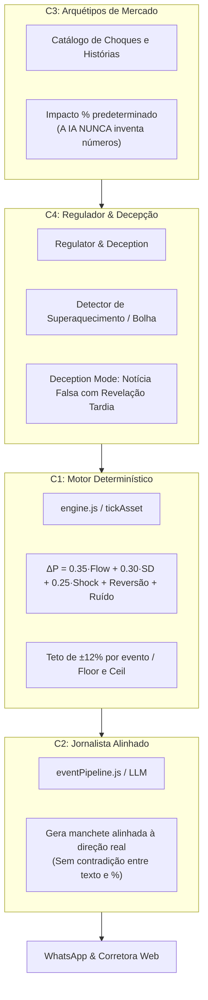
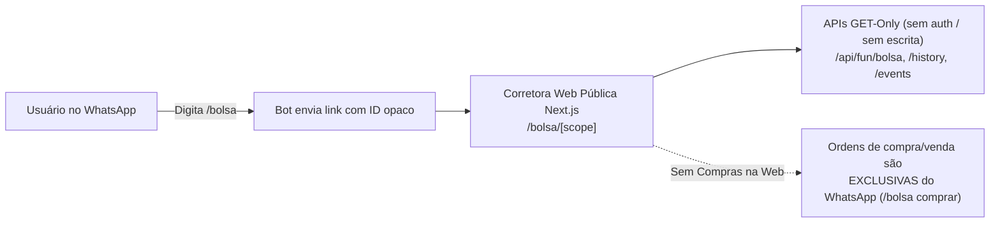

# 📈 Economia e Bolsa de Valores — Modelo de 4 Camadas

A economia do bot Fun é um dos subsistemas mais refinados do ecossistema. Localizada em `fun/economy/`, ela substitui fórmulas ingênuas por um **modelo estruturado em 4 camadas** que combina matemática financeira determinística com narrativa rica gerada por IA.

---

## 1. Arquitetura das 4 Camadas

### 1.1. Camada 1: O Motor Determinístico (`engine.js`)
Entrada estritamente numérica: volume de compra/venda, oferta/demanda e choque do arquétipo.
- **Pressão de Fluxo (`Flow`)**: `tanh((volumeBuy - volumeSell) / flowScale)`.
- **Oferta e Demanda (`SD`)**: `clamp(log(demand / supply), -1.5, 1.5) / 1.5`.
- **Reversão à Média (`Mean Reversion`)**: Se o preço sobe muito acima do valor base (`price / basePrice > 1.15`), a força de puxão para baixo cresce quadraticamente para evitar hiperinflação ("anti-foguete").
- **Ruído Gaussiano (`gauss(random)`)**: Flutuações naturais calibradas pela volatilidade da empresa.

### 1.2. Camada 2: O Jornalista Alinhado (`eventPipeline.js`)
A IA redige o sabor jornalístico da notícia com base no arquétipo e na direção real de preço calculada por C1. Isso elimina o erro clássico de bots onde a IA dizia *"BombaTech anuncia fusão histórica e dispara!"*, mas o número final saía `-8%`.

### 1.3. Camada 3: Catálogo de Arquétipos (`archetypes.js`)
Choques econômicos padronizados com impactos percentuais versionados:
- Ex.: `bureaucratic_fine` (queda moderada), `scandal_leak` (queda forte), `patent_breakthrough` (alta forte), `viral_meme` (alta explosiva).

### 1.4. Camada 4: Regulador & Decepção (`regulator.js` & `deception.js`)
- **Overheat**: Monitora se um ativo subiu por muitos ticks consecutivos e força uma correção de realização de lucros.
- **Deception Mode**: Uma notícia positiva pode ser vazada, inflando o ativo artificialmente, com um follow-up agendado para horas depois revelando uma fraude contábil e despencando o valor.

---

## 2. As 6 Corporações da Bolsa

Cada empresa possui uma **personalidade econômica distinta** em `fun/economy/companies.js`:

| Empresa | Ticker | Setor | Volatilidade | Risco | Comportamento Especial |
|---|---|---|---|---|---|
| **BurgerZap** | `BZAP` | Fast Food | Média (`0.35`) | Baixo | Blue chip estável, dividendos consistentes |
| **Uno Motors** | `UNOM` | Automotivo | Baixa (`0.25`) | Baixo | Amortece ruídos pequenos, base sólida |
| **BombaTech** | `BOMB` | Tecnologia | Alta (`0.65`) | Alto | Risco alto, queima de caixa, ganhos e quedas brutais |
| **Peixaria do João**| `PEIX` | Alimentos | Média (`0.40`) | Baixo | Ciclos sazonais fortes (quaresma / feriados) |
| **Satélite BR** | `SATB` | Telecom | Média (`0.30`) | Médio | Puxão de reversão agressivo se cair abaixo de 75% |
| **PatoCoin** | `PATO` | Cripto Meme | Extrema (`0.90`) | Extremo | *Meme spikes* aleatórios de ±25% a ±35% |

---

## 3. Corretora Web Isolada (`/bolsa/<id-grupo>`)

Cada grupo do WhatsApp possui sua própria bolsa com cotações locais.

> [!security] Privacidade e Isolamento da Corretora
> - A interface web em `fun_dashboard/src/app/bolsa/[scope]/page.tsx` é **totalmente desvinculada do painel de administração**. Não há menus de navegação, nem lista de grupos.
> - Apenas quem possui o link específico do grupo gerado no WhatsApp consegue visualizar o livro de ofertas e os gráficos históricos daquele escopo.
> - Nenhum JID de WhatsApp é retornado pela API pública da bolsa (apenas nomes anonimizados ou tickers).

---

## 4. Economia de Rua: Itens, Armas, Assaltos e Justiça

Além da bolsa de valores, a economia comunitária é regulada por um ciclo rigoroso de **Faucets (Torneiras)** e **Sinks (Sumidouros)**:
1. **Coins Ledger (`fun_coin_ledger`)**: Livro-razão imutável de todas as transações com campo `reason` para auditoria contábil.
2. **Loja Oficial (`/loja`)**: Sinks permanentes de moedas (itens utilitários, passaportes, seguros, mobis).
3. **Bazar P2P (`/bazar`)**: Mercado livre entre jogadores para venda de itens usados e cartas raras.
4. **Armas e Veículos (`/armas`, `/adquirir`)**: Itens com durabilidade e condição física que quebram com o tempo e exigem conserto (`/consertar`).
5. **Assaltos e Defesas (`/assaltar`)**: Mecânica de tensão social onde o alvo recebe um desafio matemático em tempo real para se defender.
6. **Contratos de Caça Submundo (`/bounty`)**: Jogadores financiam recompensas na cabeça de rivais. Cada contrato queima **$20\%$ em taxa de submundo permanente (Sink)**, e o pagamento aos caçadores no assalto segue a regra de proporcionalidade (dobro do roubo real, preservando o saldo restante aberto).
7. **Tribunal do Povo (`/tribunal`)**: Caução judicial de $150$ coins em escrow. Condenações transferem multas de até $10\%$ com base na solvência real do réu (sem emissão de moeda fantasma). Absolvições transferem a caução como indenização por lide temerária.
8. **Custas Judiciais em Divórcio Litigioso**: Casos de adultério flagrado retêm **$10\%$ da indenização queimados pelo cartório** (`divorce-court-fee-sink`), atuando como regulador contra transferência abusiva de capital.

---

## 5. Navegação Relacionada
- [[01 - Arquitetura e Runtime]]: Ticks do relógio do mundo que movimentam as cotações.
- [[05 - Panelinhas e Dinâmica Social]]: Vínculos 4D, contratos de caça e o Tribunal do Povo.
- [[06 - Jogos e Cassino]]: Jogos de aposta que funcionam como sinks e faucets de moedas.
- [[08 - Empregos CLT e Simuladores]]: Salários que irrigam a economia de rua.
