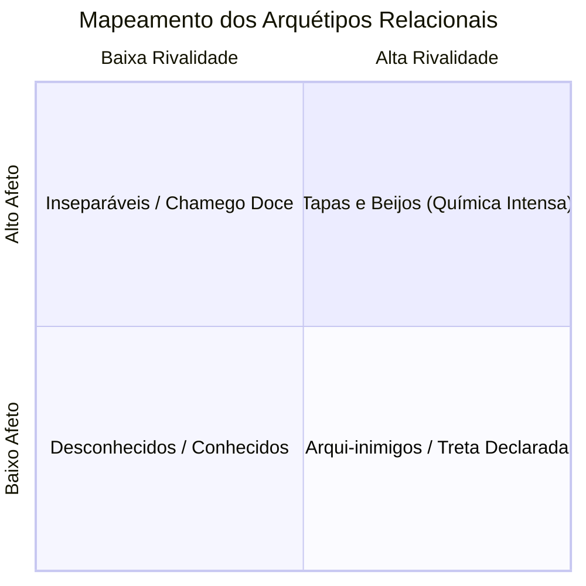
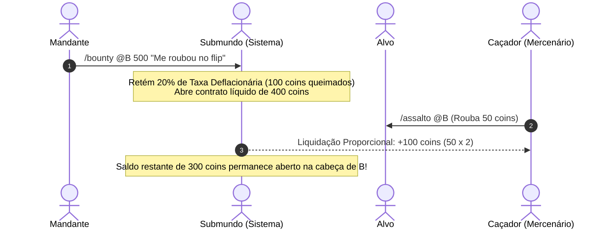
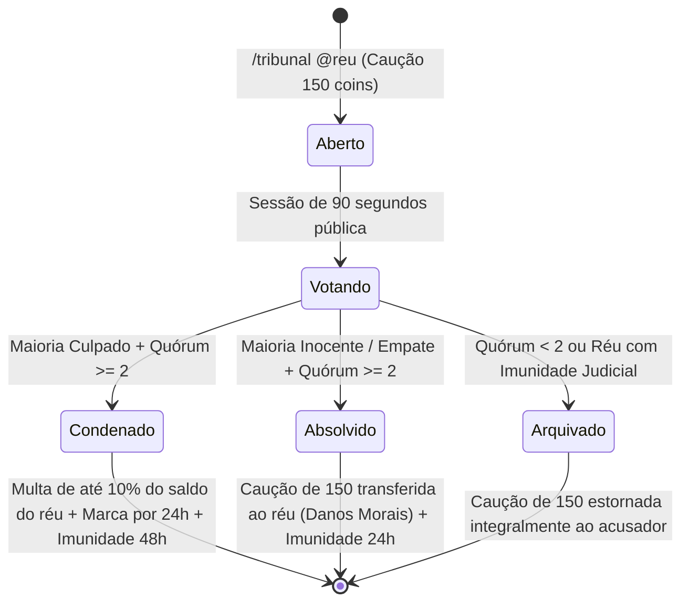
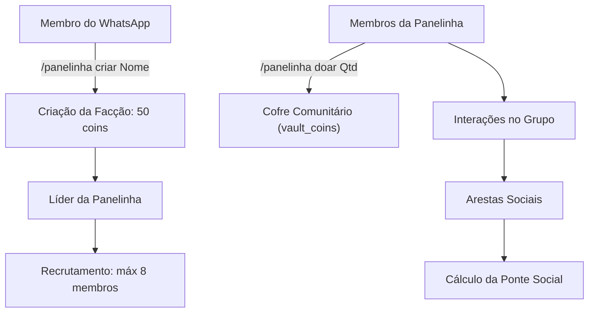

# 🏴‍☠️ Panelinhas, Vínculos 4D e o Ecossistema Social

O bot Fun introduz um mecanismo profundo e vivo de dinâmicas interpessoais: as **Panelinhas (Facções)** e a **Matriz Contínua de Vínculos Sociais 4D**. Grupos de WhatsApp deixam de ter interações superficiais ou isoladas; cada ação (seja um carinho, uma bofetada, uma transferência ou um assalto) gera consequências persistentes, molda a química dos membros e impacta a economia e o tribunal do grupo.

---

## 1. A Matriz de Vínculos Sociais 4D (`fun_social_bonds`)

Em substituição a históricos efêmeros ou tabelas rasas, cada par de usuários possui um vetor contínuo no espaço $[0, 100]^4$ persistido no SQLite:

$$\vec{B}(u_a, u_b) = \begin{bmatrix} \text{Afeto } (A) \\ \text{Rivalidade } (R) \\ \text{Intimidade } (I) \\ \text{Caos } (C) \end{bmatrix} \in [0, 100]^4$$

### 1.1. Propriedades Matemáticas do Sistema:
- **Normalização Lexicográfica Canônica**: Toda relação é indexada bidirecionalmente garantindo que $u_a < u_b$ por ordem lexicográfica de JID, evitando duplicação de dados ($A \leftrightarrow B$ é a mesma linha que $B \leftrightarrow A$).
- **Decaimento Temporal Assimétrico**: O tempo esfria as tensões rapidamente, mas preserva laços afetivos:
  - **Caos**: Decai $15\%$/dia (mínimo de 2 pts/dia).
  - **Rivalidade**: Decai $10\%$/dia (mínimo de 2 pts/dia).
  - **Afeto**: Decai $5\%$/dia (mínimo de 1 pt/dia).
  - **Intimidade**: Decai apenas $3\%$/dia (mínimo de 1 pt/dia).
  - *Persistência Eficiente*: O decaimento é calculado e gravado no banco automaticamente apenas quando transcorrido pelo menos 1 dia inteiro sem interações, garantindo zero escritas desnecessárias em leituras normais.
- **Soft-Cap Diário e Diminishing Returns**: Para frustrar scripts de farm e macros sem travar o roleplay dos usuários, cada par possui ganhos decrescentes diários:
  - 1ª interação do dia: $100\%$ do delta.
  - 2ª interação: $60\%$ do delta.
  - 3ª interação: $30\%$ do delta.
  - 4ª em diante: $0\%$ de ganho relacional (relação saturada no dia).
- **Fator de Reciprocidade Dinâmica**: Interações em vaivém ($A \to B$ seguido de $B \to A$) conferem bônus de $+1.5$ em Intimidade. Insistência unilateral repetitiva dispara $+1.0$ em Caos.

### 1.2. Os 8 Arquétipos Emergentes (`classifyBond`):
1. **Desconhecidos** ($I < 8, A < 12, R < 12$): Duas almas que mal se cruzam no grupo.
2. **Tapas e Beijos** ($A \ge 50, R \ge 35$): Entre farpas e carinhos, química caótica imprevisível.
3. **Inseparáveis** ($A \ge 65, I \ge 40, R < 30$): Sintonia pura e lealdade incondicional.
4. **Arqui-inimigos** ($R \ge 50, C \ge 35, A < 30$): Sangue nos olhos; se um cair, o outro comemora.
5. **Cúmplices de Crime** ($I \ge 35, C \ge 40, R < 35$): A mente por trás das maiores loucuras do grupo.
6. **Treta Declarada** ($R \ge 40, I < 30$): Faísca solta, qualquer menção vira guerra.
7. **Chamego Doce** ($A \ge 35, R < 25$): Amizade fofa repleta de mimos e afagos.
8. **Agentes do Caos** ($C \ge 45, A < 40, R < 40$): Interagem exclusivamente para rir da cara da comunidade.

Comando visual: `/relacao @pessoa` renderiza o diagnóstico com barras progressivas ASCII de cada dimensão.

---

## 2. Eventos Cinematográficos & Procs Sociais

As interações de carinho e zoeira (`/kiss`, `/slap`, `/cuddle`, `/bite`, `/hug`, `/pat`) agora contam com mecânicas emergentes em tempo real:

- **Contra-Tapa Relâmpago (Janela QTE de 45s)**:
  - Ao receber um `/slap`, a vítima ganha uma janela de revide de 45 segundos.
  - Se desferir `/slap` de volta no agressor dentro do prazo, ativa o **Revide de Bofetada**: som amplificado com o dobro de volume, texto dramático e transferência de rivalidade amplificada.
- **Revolução Social (Proc Crítico)**:
  - Reações afetuosas têm chance de acionar um momento crítico:
    $$\text{Chance} = \min(0.35, 0.05 + 0.003 \times I)$$
  - Recompensa: $+15$ XP e $+5$ coins ao autor com anúncio público.
  - *Trava Anti-Macro*: Se a relação diária atingir o soft-cap (saturada com 3+ ações), o proc de moedas/XP é automaticamente desativado para neutralizar bots de spam.
- **Esquiva Cômica**:
  - Tentar chamego (`/kiss`, `/cuddle`, `/handhold`) com quem possui $R \ge 40$ e $A \le 25$ faz o alvo desviar agilmente fingindo olhar o relógio, criando climão público no grupo.

---

## 3. Compatibilidade Real no `/ship`

O `/ship` foi completamente reformulado para abandonar geradores de hash pseudo-aleatórios:

$$\text{Compatibilidade} = 0.40 \cdot A + 0.30 \cdot I + 0.20 \cdot (100 - R) + 0.10 \cdot C$$

- O resultado varia entre $1\%$ e $99\%$ e deriva da convivência comprovada entre os jogadores.
- Sem histórico prévio: retorna $50\%$ com o diagnóstico *"Uma folha em branco esperando a primeira fagulha"*.
- Casais com arquétipos definidos ganham laudos narrativos personalizados gerados pela Persona.

---

## 4. Mercado de Contratos de Caça Submundo (`/bounty`)

Membros com sede de vingança podem terceirizar a punição de seus desafetos:

### Regras do Submundo:
1. **Sink Deflacionário de 20%**: Ao emitir o contrato (mínimo de 20 coins), $20\%$ do valor é retido e **destruído permanentemente**, servindo como regulador macroeconômico. No cancelamento pelo mandante, apenas os $80\%$ líquidos são estornados.
2. **Resgate Proporcional ao Dano (Regra de EVE Online)**:
   - Para impedir que alvos esvaziem a carteira e combinem com amigos para auto-colher a recompensa (*self-harvesting*), o pagamento é proporcional ao estrago do assalto:
     $$\text{Recompensa Paga} = \min(\text{Bounty Disponível}, \max(20, \lfloor\text{stolenCoins} \times 2.0\rfloor))$$
   - O valor restante do contrato permanece ativo na cabeça do alvo até novos assaltos.
3. **Anti-Conluio Estrito**:
   - É proibido colocar bounty no próprio cônjuge ou em membros da mesma panelinha.
   - O caçador não pode ser o mandante, nem cônjuge do alvo, **nem pertencer à mesma panelinha do alvo**.

---

## 5. O Tribunal do Povo (`/tribunal` e `/voto`)

Quando a ordem comunitária é quebrada, qualquer membro pode convocar um julgamento por jurados populares:

### Mecânicas Processuais:
- **Caução Judicial**: O acusador deposita $150$ coins na abertura (`DEFAULT_TRIAL_BAIL`).
- **Quórum Mínimo Popular**: Exige-se ao menos 2 jurados votantes. Sessões vazias são arquivadas por falta de quórum e a caução é devolvida.
- **Ponderação Anti-Panelinha**: Votos de cônjuges ou membros da mesma facção do acusador possuem peso reduzido para **$0.3\times$**, neutralizando a tirania de maiorias artificiais.
- **Condenação**:
  - Réu multado em $10\%$ do saldo real (teto de 300 coins, sem emissão de moeda fantasma).
  - Acusador recebe a caução de volta ($150$) mais a multa do réu como indenização.
  - Réu recebe a insígnia pública de *Condenado(a)* por 24h e Imunidade Judicial por 48h.
- **Absolvição (Litigância de Má-Fé)**:
  - Acusação julgada leviana: o acusador perde a caução de 150 coins, transferida integralmente ao réu como indenização por danos morais.
  - Réu ganha Imunidade Judicial de 24h contra processos sucessivos.
- **Encerramento Controlado**: O comando `/tribunal resolver` bloqueia tentativas de encerramento precoce enquanto a votação estiver em curso e permite a proclamação oficial assim que o tempo expira.

---

## 6. Fidelidade Matrimonial & Divórcio Litigioso

O casamento evoluiu para um contrato dinâmico com impacto econômico e jurídico:

- **Bônus de Fidelidade Matrimonial**: Cônjuges que interagem ativamente no grupo (confirmado pelo bond 4D nas últimas 48h) recebem **$+15\%$ de moedas no `/daily`**.
- **Flagrante de Adultério**: Se um membro casado trocar carinhos afetuosos com um terceiro, a traição é carimbada no vínculo matrimonial.
- **Divórcio Litigioso por Infidelidade**:
  - A vítima pode acionar `/divorcio` sem pagar custos.
  - O adúltero sofre retenção forçada de **$20\%$ de seu patrimônio** (mínimo de 30, teto de 5.000 coins).
  - **Taxa Cartorária (Sink Deflacionário)**: O cartório retém $10\%$ da indenização e a destrói (`divorce-court-fee-sink`). Os $90\%$ restantes chegam à conta da vítima de forma atômica via `transferCoins`.

---

## 7. O Sistema de Panelinhas e Ponte Social

As panelinhas continuam operando como clãs oficiais no `fun/factions/`:

### Regras Centrais:
- **Custo e Capacidade**: 50 coins para fundar, 25 coins para sair (`factionMaxMembers: 8`).
- **Cofre Coletivo (`vault_coins`)**: Financia guerras, compras conjuntas e eventos.
- **Ponte Social Anti-Bolha (`bridgeService`)**:
  $$\text{Ponte} = \frac{\text{Interações com Outras Panelinhas}}{\text{Total de Interações}}$$
  - Se a facção mantiver menos de $25\%$ de interações externas, recebe debuff de $-10\%$ no XP do daily até restabelecer contato comunitário.
- **Missões Mistas (`missionService`)**: Sorteia squads temporários entre membros de facções rivais com prêmio de 30 coins por cooperarem juntos.

---

## 8. Navegação Relacionada
- [[00 - Hub Central]]: Retorno ao índice mestre.
- [[04 - Economia e Bolsa de Valores]]: Torneiras, sumidouros e taxas judiciais.
- [[06 - Jogos e Cassino]]: Jogos de equipe, quiz royale e duelos.
- [[10 - Catálogo de Comandos e Regras]]: Lista completa de sintaxe e comandos sociais.
