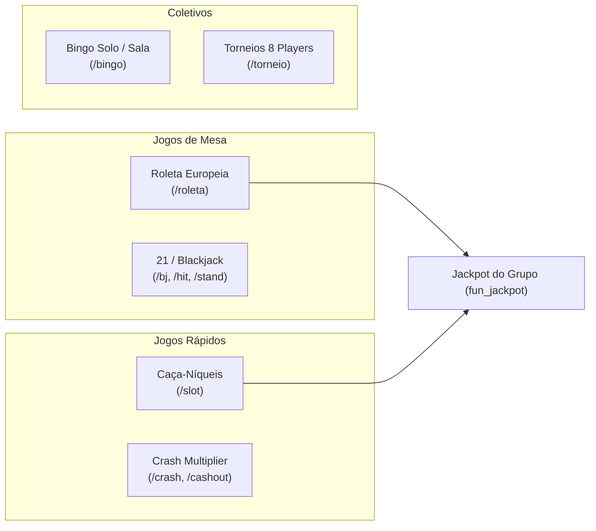
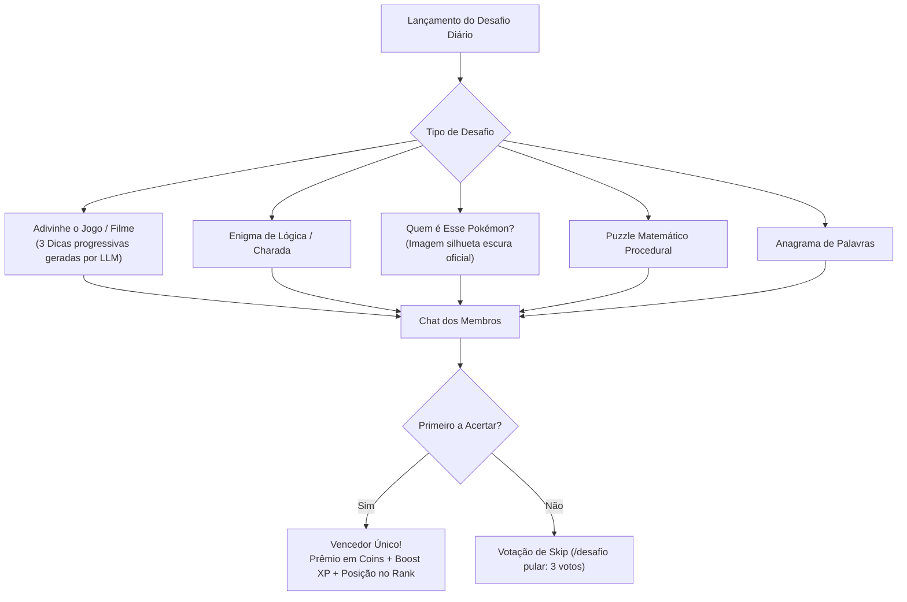

# 🎲 Jogos e Cassino — Mecânicas e Regras

O módulo `fun` disponibiliza uma ampla suíte de apostas, jogos casuais e competições multiplayer em tempo real. **Todo o RNG de jogos é 100% determinístico e executado no servidor Node.js**, sem qualquer interferência de IA nos sorteios.

---

## 1. O Cassino Completo (`fun/casino/` & `casinoService.js`)

### 1.1. Roleta Francesa com Regra *La Partage* (`rouletteEngine.js`)
- **Roda Europeia**: 37 casas (0 a 36).
- **Tipos de Aposta Suportados**: Número pleno (`pleno 17`), cores (`vermelho`, `preto`), paridade (`par`, `impar`), metades (`baixo 1-18`, `alto 19-36`), dúzias (`d1`, `d2`, `d3`) e colunas (`c1`, `c2`, `c3`).
- **Regra *La Partage***: Em apostas de chance simples (cor, par, metade), se a bola cair no **Zero (0)**, o jogador recebe **metade da aposta de volta**, reduzindo a vantagem da casa para 1.35%.
- **Histórico e Estatísticas**: O motor registra os últimos giros em `fun_roulette_history` e fornece estatísticas de quentes/frios para alimentar os palpites do grupo.

### 1.2. 21 / Blackjack (`/bj`)
- Baralho padrão com cálculo dinâmico de Ás flexível (1 ou 11).
- Sessão persistida em `fun_casino_sessions` com TTL de 5 minutos.
- Ações: `/hit` (pedir carta) e `/stand` (parar). Dealer para obrigatoriamente no 17. Payout de 2.5x em Blackjack natural.

### 1.3. Crash (`/crash`)
- Multiplicador sobe progressivamente. O jogador precisa dar `/cashout` antes do crash aleatório.

### 1.4. Bingo Solo & Coletivo (`bingoLogic.js`)
- Cartela gerada proceduralmente 5x5. Suporta vitória por Linha, Coluna ou Cartela Cheia (Bingo!).

---

## 2. Jogos Casuais de Grupo

- **Cara ou Coroa (`/cf 50 cara`)**: Duelo simples contra a banca com taxa da casa de 5%.
- **Duelo de Apostas (`/aposta @user 100`)**: Desafio peer-to-peer. O bot bloqueia o valor de ambos e realiza o sorteio público no chat.
- **Roleta Russa (`/roletarussa`, `/puxar`)**: Tambor de 6 tiros com 1 bala real. Se disparar, o jogador entra em estado de "morte virtual" temporária (`isXpBlocked`), ficando sem ganhar XP por algumas horas.

---

## 3. Desafios Diários de Conhecimento (`dailyChallengeService`)

Uma vez por dia, em horário surpresa aleatório, o bot lança um desafio no grupo em `fun/services/dailyChallengeService.js`:

### Destaque: Quem é Esse Pokémon?
- Integra com a **PokeAPI** oficial.
- Baixa o sprite oficial e aplica máscara de silhueta preta via Sharp.
- Envia a imagem no chat. O primeiro que responder o nome correto em português ou inglês ganha o prêmio. A IA gera dicas baseadas em tipo, geração e habitat.

---

## 4. Jogos Web Multiplayer em Tempo Real (`fun/games/`)

O bot implementa jogos web em tempo real através de uma arquitetura SSE (Server-Sent Events) conectando o WhatsApp ao navegador dos jogadores:

| Jogo | Tipo | Min/Max Jogadores | Dinâmica |
|---|---|---|---|
| **Quiz Royale das Panelinhas** | Batalha de Trivia | 4 a 20 | Perguntas geradas dinamicamente por IA com temas votados na hora. Pontuação calculada pela média da panelinha. |
| **Grid CTF** | Estratégia em Grid | 2 a 8 | Captura de bandeira em arena tática isométrica por turnos. |
| **King of the Hill** | Domínio de Território | 4 a 8 | Conquista e defesa de 3 zonas estratégicas para somar pontos para a facção. |

> [!tip] Conexão e Heartbeat SSE
> As salas rodam no servidor Next.js em `fun_dashboard/src/app/jogos/[roomId]`. O `gameManager.js` emite eventos SSE contínuos com heartbeat de 15 segundos para compatibilidade estrita com tunnels Cloudflare.

---

## 5. Navegação Relacionada
- [[04 - Economia e Bolsa de Valores]]: Como as apostas movimentam os cofres e alimentam o jackpot.
- [[05 - Panelinhas e Dinâmica Social]]: Batalhas multiplayer disputadas entre facções.
- [[10 - Catálogo de Comandos e Regras]]: Comandos de aposta e regras de cooldown.
