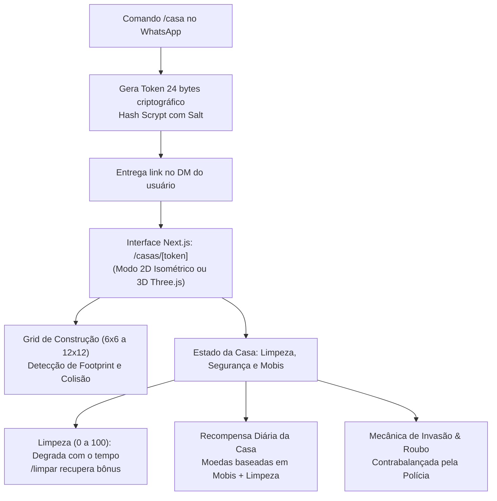
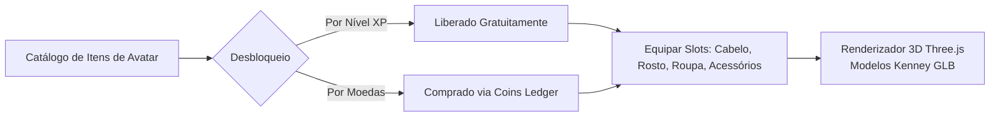

# 🏠 Casas, Avatares e Carros — O Mundo Virtual Interativo

O módulo `fun` transcende a interface de texto do WhatsApp ao disponibilizar um **mundo virtual isométrico e 3D**, permitindo que cada membro possua sua residência decorada (estilo Habbo Hotel), vista seu avatar 3D e tune seu carro próprio em estúdios web dedicados.

---

## 1. Casas Virtuais (`fun/services/houseService.js`)

Ao digitar `/casa` no grupo, o bot orienta o membro a abrir o privado, onde recebe um **link seguro com token único (`/casas/{token}`)**.

### 1.1. Sistema de Física de Grid e Mobis
- **Footprint e Empilhamento (`checkFootprintOverlap`)**: Os móveis possuem largura e profundidade no grid. Superfícies planas (como mesas) possuem flag `isSurface`, permitindo empilhamento de itens pequenos (1x1) no topo em diferentes eixos Z.
- **Rotação de 4 Direções**: Móveis podem ser rotacionados em 0°, 90°, 180° e 270°.
- **Estilos Estruturais**: Paredes (`wall_style`), pisos (`floor_style`) e janelas (`window_style`) personalizáveis via catálogo.

### 1.2. Dinâmica Social das Casas:
- **Visitas com Mural de Recados (`/visitar`)**: Jogadores podem entrar na casa dos amigos e deixar notas carinhosas ou piadas no mural.
- **Presentes (`giftService`)**: Envio de móveis ou pacotes de coins diretamente para a casa de outro membro.
- **Invasões e Roubos (`robberyService`)**:
  - Jogadores podem tentar roubar um mobi de uma casa rival.
  - A chance de sucesso diminui com o nível de segurança da casa (`security_level`).
  - Itens roubados transferem propriedade total para o invasor.
  - Se a polícia virtual (`policeService`) interceptar o ladrão, ele é multado e detido.

### 1.3. Som do Bairro (`soundSystemService`)
Um tocador comunitário de YouTube compartilhado entre as casas do grupo, sincronizado via Server-Sent Events e controle de revisão (`revision`).

---

## 2. Customização de Avatares V2 (`fun/services/avatarService.js`)

Acessado pelo link pessoal `/casas/{token}/avatar`, o jogador customiza a aparência do seu personagem:

- **Renderizador 3D**: Utiliza modelos low-poly otimizados (`character-b.glb`, `character-c.glb`, `character-e.glb`) com texturas dinâmicas.
- **Idempotência Estrita**: As alterações de vestimenta utilizam `idempotencyKey` e controle de revisão (`catalogRevision`), evitando compras duplicadas ou condições de corrida.

---

## 3. Garagem e Customização de Carros (`fun/services/carService.js`)

Se o jogador comprou o item `carro` no mercado, ele desbloqueia a garagem em `/carros/{token}`:

| Componente | Opções de Customização |
|---|---|
| **Pintura** | Cor primária (`#hex`), cor secundária e decalques personalizados |
| **Rodas** | Rodas clássicas, esportivas, tunadas e off-road |
| **Aerofólio & Neon** | Vários modelos de spoilers traseiros e luzes de neon sob o chassi |
| **Suspensão** | Normal, rebaixada e *lowrider* |
| **Insulfilm & Placa** | Níveis de tonalidade de vidro e placa personalizada com até 7 caracteres |

- **Renderizador Duplo**:
  - **3D em Tempo Real**: Estúdio interativo Three.js no navegador.
  - **2D Procedural SVG/PNG (`carRenderer.js`)**: Gera imagens vetoriais e bitmaps do carro tunado para serem enviadas diretamente no chat do WhatsApp quando o jogador digita `/meucarro`.

---

## 4. Navegação Relacionada
- [[04 - Economia e Bolsa de Valores]]: Compra de móveis, peças de carro e itens de avatar.
- [[05 - Panelinhas e Dinâmica Social]]: Roubos e visitas entre panelinhas rivais.
- [[09 - Dashboard e Observabilidade]]: Interface web onde as casas e avatares são renderizados.
