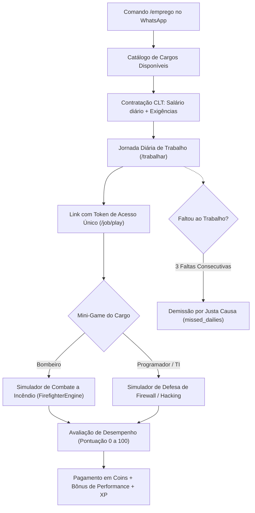
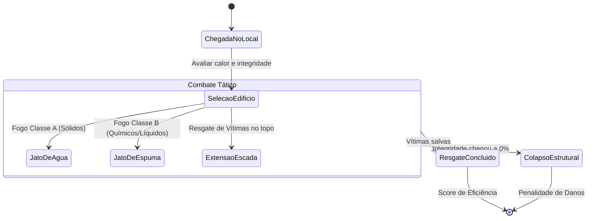

# 🚒 Empregos CLT e Simuladores Táticos

O bot Fun introduz um sistema de carreira formal com **contratação CLT (`/emprego`)**, salário diário, regras de demissão por falta e **simuladores táticos jogáveis no navegador**. Diferente do freela rápido (`/trabalhar`), os empregos fixos exigem desempenho em mini-games com física e lógica determinística.

---

## 1. Carreira CLT e Ciclo de Trabalho (`jobService.js`)

### Regras de Emprego:
- **Salário Fixo + Comissões**: O jogador recebe uma remuneração base diária, multiplicada pelo score obtido no simulador web.
- **Assiduidade**: Se o jogador deixar de bater o ponto diário por dias consecutivos (`missed_dailies`), ele é advertido e pode ser demitido automaticamente.
- **Demissão Voluntária (`/demitir sim`)**: O jogador pode pedir demissão a qualquer momento para trocar de carreira.

---

## 2. Simulador Tático de Bombeiros (`fun/firefighters/`)

O cargo de Bombeiro possui um simulador físico em canvas WebGL/OpenGL (`FirefighterGameOpenGL.tsx`) governado por um motor determinístico desacoplado (`FirefighterEngine.js`).

### 2.1. Física do Simulador (`FirefighterEngine`):
- **Recursos do Caminhão**:
  - Tanque de Água: 3000 litros (`TANK_SPECS.WATER_MAX_LITERS`).
  - Tanque de Espuma: 500 litros (`TANK_SPECS.FOAM_MAX_LITERS`).
  - Conexão com Hidrante: Permite recarga lenta em campo.
- **Modos de Esguicho (`NOZZLE_MODES`)**:
  - `WATER_JET`: Jato concentrado de alta pressão (alcance longo, resfriamento rápido).
  - `WATER_FOG`: Neblina de água (dissipa fumaça e protege contra radiação térmica).
  - `FOAM`: Espuma química especial (obrigatória para incêndios elétricos ou inflamáveis).
- **Integridade Estrutural**: Conforme o calor (`heat`) aumenta, a integridade do prédio cai. Se chegar a zero, o edifício desaba (`isCollapsed`), resultando na perda das vítimas ainda presas.

---

## 3. Segurança dos Mini-Games Web (`fun/jobs/token.js`)

Para impedir que jogadores forjem scores altos enviando requisições diretas via Postman ou script:
1. **Tokens HMAC SHA-256 de Sessão**: Cada tentativa gera um token único com `nonce` criptográfico vinculado ao `user_jid` e `job_id`.
2. **Tempo Mínimo de Jogo**: A API rejeita finalizações instantâneas que não respeitam a duração física mínima da partida.
3. **Métricas de Validação**: O cliente web deve enviar métricas intermediárias da simulação (litros usados, vítimas salvas, precisão dos cliques) que são validadas contra as regras do motor.

---

## 4. Navegação Relacionada
- [[04 - Economia e Bolsa de Valores]]: Circulação dos salários na economia.
- [[07 - Casas, Avatares e Carros]]: Recompensas de trabalho usadas na mobília e na garagem.
- [[09 - Dashboard e Observabilidade]]: Interface onde os mini-games rodam.
