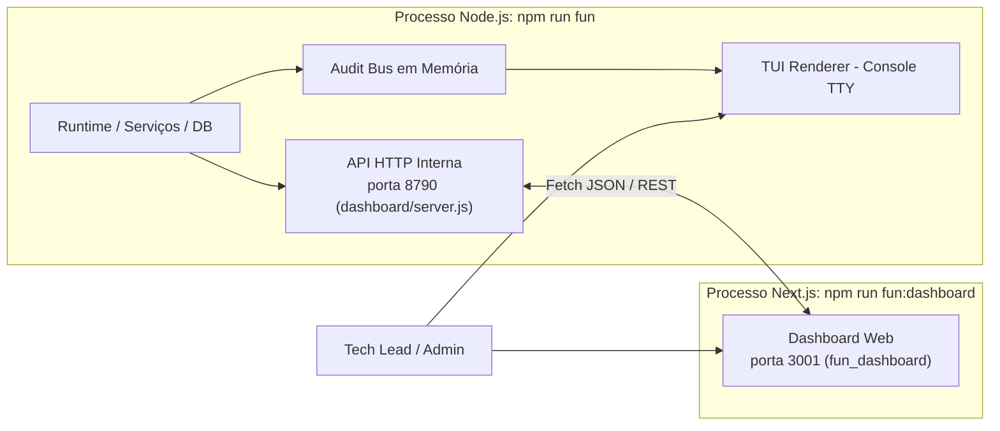

# 📊 Dashboard e Observabilidade

O módulo `fun` dispõe de uma camada completa de telemetria e controle operacional dividida em **duas interfaces principais**: um **Painel TUI (Terminal User Interface)** para o operador do console e um **Dashboard Web Next.js 15** consumindo a API HTTP interna do bot.

---

## 1. Arquitetura de Comunicação e Portas



| Superfície | Porta Padrão | Responsabilidade | Autenticação / Acesso |
|---|---|---|---|
| **API Embutida** | `8790` (`127.0.0.1`) | Servidor HTTP nativo do bot expondo endpoints de estado, config e controle | Localhost / Sem exposição direta |
| **Dashboard Next.js** | `3001` (`127.0.0.1`) | UI moderna para gestão de grupos, auditoria de dados e jogos 3D | Admin / Acesso web local ou túnel |
| **Corretora Web** | `3001` (`/bolsa/[scope]`) | Visualização pública read-only do livro de ofertas e gráficos de cada grupo | Pública com JID/Hash do grupo |

---

## 2. O Painel TUI do Terminal (`fun/tui/`)

Quando iniciado em um terminal interativo (TTY), o bot converte a tela em um **painel full-screen** alimentado pelo `auditBus.js`, redirecionando logs brutos do Pino/Baileys para o `stderr` para não corromper o layout.

```
┌─ [TooManyBots Fun - Painel Operacional] ───────────────────────────────────────────┐
│ [1] Auditoria   [2] Saúde   [3] Economia   [4] LLM   [5] Grupos   │  Tab: Alternar │
├──────────────────────────────────────────────────────────────────────────────────┤
│ 14:22:01 [market] tick concluído (changed=4, stockChanged=2, shock=-0.04)        │
│ 14:22:46 [world-tick] ok (tookMs=18ms, fired=1: happy-hour)                      │
│ 14:23:12 [llm] persona:zen (tokens=240, tookMs=1420ms) scope=120363...           │
│ 14:23:30 [self-heal] sweep finalizado (mode=dry_run, findings=0)                 │
└──────────────────────────────────────────────────────────────────────────────────┘
```

### Abas do Painel:
1. **Auditoria (`auditPanel.js`)**: Histórico de eventos do mundo categorizados (`market`, `news`, `self-heal`, `chaos`).
2. **Saúde (`healthPanel.js`)**: Conexão Baileys, latência, reconexões e tamanho das filas (`commandQueue` e `outputQueue`).
3. **Economia (`economyPanel.js`)**: Detalhes dos últimos ticks do motor C1, volume acumulado e alertas de overheat.
4. **LLM (`llmPanel.js`)**: Contadores por tarefa e provedor (Zen vs Template offline), com alerta sonoro se `templateRate ≥ 40%`.
5. **Grupos (`groupsPanel.js`)**: Grupos da whitelist, comandos mais usados e participantes mais ativos.

---

## 3. Dashboard Web Administrativo (`fun_dashboard/`)

Construído em **Next.js 15, React 19, Tailwind CSS e Lucide Icons**, oferece controle cirúrgico sobre a operação:

### 3.1. Gestão Granular de Grupos (`/groups`)
- Ativar/desativar o bot por grupo sem tirá-lo do WhatsApp.
- Habilitar/desabilitar comandos específicos por grupo (`disabled_commands`).
- Configurar taxas de XP locais, limites de rank e horários de quiet hours.
- Toggle de conteúdo adulto (`permitir_nsfw`).

### 3.2. Painel de Auto-Aprimoramento (`/selfheal`)
- Visualização das varreduras de integridade executadas.
- Alternar entre `dry-run` e execução ao vivo.
- **Aprovação de Pendências de Alto Risco**: Interface para aprovar ou rejeitar propostas de supressão ou alteração de dados feitas pelo auditor de IA.

### 3.3. Monitor de IA e Governança (`/llm`)
- Visualização de latência média, volume de tokens consumidos e taxa de fallback para templates offline.

### 3.4. Transmissão de Changelogs (`/changelog`)
- Interface para redação e disparo controlado de comunicados de atualização para todos os grupos da whitelist simultaneamente.

---

## 4. Navegação Relacionada
- [[01 - Arquitetura e Runtime]]: Inicialização do servidor de dashboard e filas.
- [[03 - Memória e Auto-Aprimoramento]]: Auditoria de dados exibida na tela de self-heal.
- [[04 - Economia e Bolsa de Valores]]: Visualização das cotações da corretora web.
